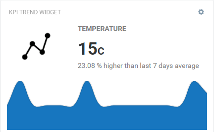

# Cumulocity KPI Trend Widget Plugin 

This KPI Trend Widget is the Cumulocity module federation plugin created using c8ycli. This plugin can be used in Application Builder or Cockpit. It shows current measurement value in realtime and a chart based on measurement values as datapoints in widget.

### Please choose KPI Trend Widget release based on Cumulocity/Application builder version:

|APPLICATION BUILDER | CUMULOCITY | KPI TREND WIDGET PLUGIN  |
|--------------------|------------|--------------------------|
| 2.x.x(coming soon) | >= 1016.x.x| 1.x.x                    |

## Features
* Supports measurements from a single device
* Allows color customization for KPI and the trend chart.
* Allows to configure threshold values and do color customization.
* Allows to upload custom image to represent the KPI.
* Supports different chart types.

## Prerequisite
   Cumulocity c8ycli >=1016.x.x
   
## Installation

### Configuration - to view the KPI and trend Chart in the widget
1. Make sure you have successfully installed the plugin.
2. Click on `Add widget`.
3. Choose `KPI Trend` widget.
4. `Title` is the title of widget. Provide a relevant name. You may choose to hide this. Go to `Appearance` tab and choose `Hidden` under `Widget header style`.
5. Select the `device`.
6. `KPI title` is the name of the KPI you want to show. Example: Temperature, Humidity.
7. `Upload KPI icon` allows you to upload relevant icon. Icon should be a image format like .png, jpg, etc.
8. `Measurement` allows you to choose the Fragment and Series combined. It automatically gets populated based on the device selected.
9. `KPI aggregation interval` is an interval to choose the measurements from to calculate the KPI.
10. `KPI color` is the custom color you may want to specify. Clicking this field opens a color picker to help you selecting a color.
11. `KPI unit` is a unit value you to specify. Providing this value override the value received with measurement. Leave blank if you don't want to override. Examples: km, m, kg, etc.
12. `KPI threshold enabled` and its related fields allows you to configure threshold values. KPI will change its color on reaching the threshold values. Threshold values are inclusive.
13. `Chart enabled` is to show or hide chart in the widget.
14. `Chart type` is the type of the chart you want to see. There are 2 options line and bar.
15. `Chart position` decides where to chart in the widget with respect to the KPI.
15. `Chart height` is the height of the chart you want to configure in pixels.
15. `Chart color` is the color of the chart you want to see. Clicking this field opens a color picker.
16. `Chart aggregation type` is whether you want to retrieve the measurement to be plotted on the chart based on the interval or the custom number.
17. Click `Save` to add the widget on the dashboard.
18. In case you see unexpected results on the widget, refer to browser console to see if there are error logs.

### Runtime Widget Deployment?

* This widget support runtime deployment. Download [Runtime Binary](https://github.com/SoftwareAG/cumulocity-kpi-trend-widget-plugin/releases/download/1.0.2/cumulocity-kpi-trend-widget-plugin-1.0.2.zip) and install via Administrations --> Ecosystems --> Applications --> Packages 

## QuickStart

This guide will teach you how to add widget in your existing or new dashboard.

1. Open your application from App Switcher

2. Add new dashboard or navigate to existing dashboard

3. Click `Add Widget`

4. Search for `KPI Trend`

5. Select `Target Assets or Devices`

7. Click `Save`

Congratulations! KPI Trend is configured.

------------------------------

This widget is provided as-is and without warranty or support. They do not constitute part of the Software AG product suite. Users are free to use, fork and modify them, subject to the license agreement. While Software AG welcomes contributions, we cannot guarantee to include every contribution in the master project.
_____________________
For more information you can Ask a Question in the [TECH Community Forums](https://tech.forums.softwareag.com/tag/Cumulocity-IoT).
